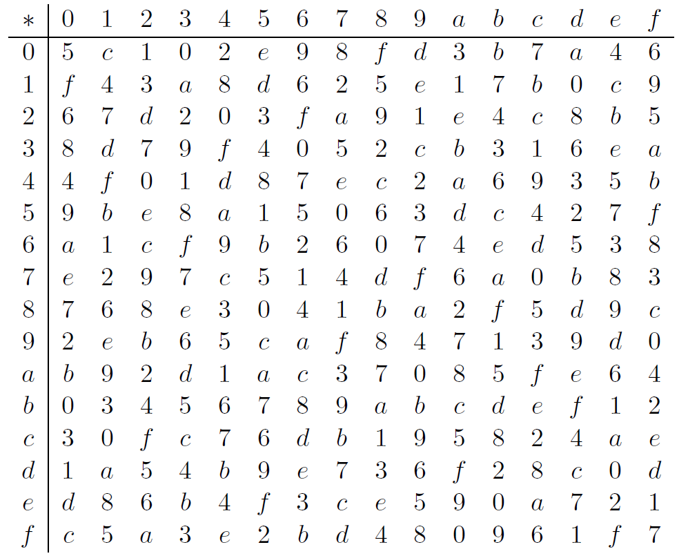
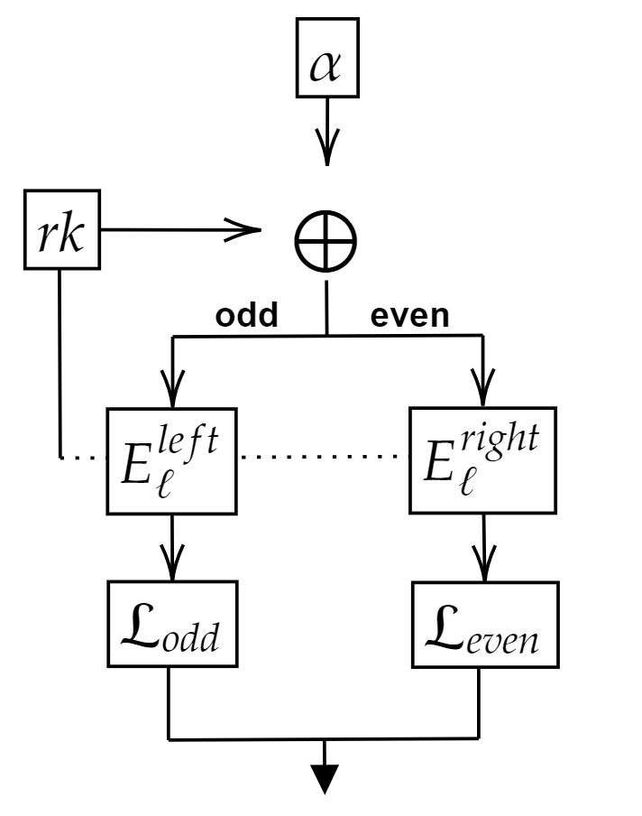

# Анализ квазигруппового шифра INRU

Проект посвящен анализу квазигруппового блочного шифра INRU.

Основные задачи:
- разобраться, какие полезные (с точки зрения криптографии) свойства бывают у квазигрупп;
- разобраться, какие есть способы генерировать квазигруппы с полезными свойствами;
- попробовать сгенерировать некоторое количество квазигрупп и посчитать их характеристики;
- попробовать найти более удачную квазигруппу для блочного шифра INRU.

Структура проекта:
- article: папка для итоговой статьи по проекту + весь материал к нему;
- code: папка для исходных кодов экспериментов;
- description: общее описание проекта + исходная статья;
- presentation: папка для презентации (защита проекта);
- stuff: всякое разное, что не вписывается в первые 4 папки.

